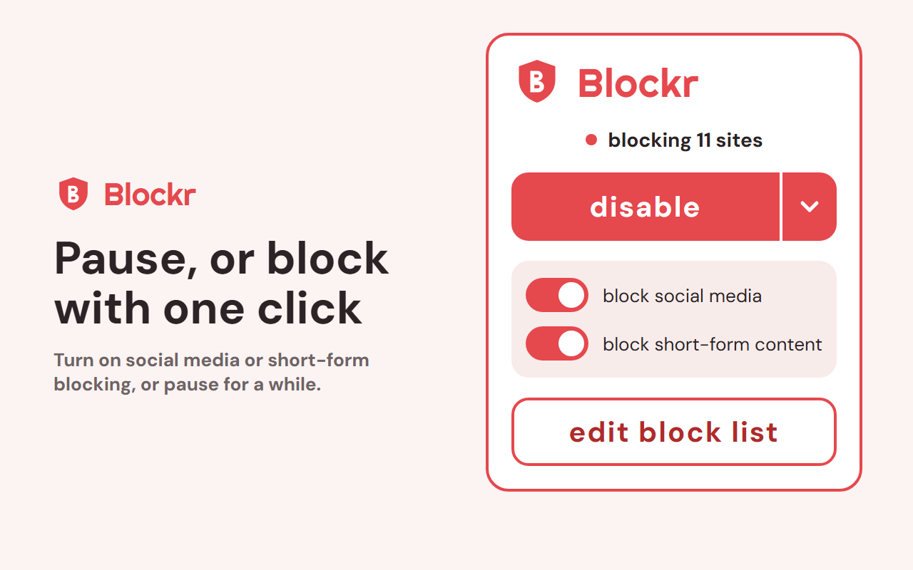
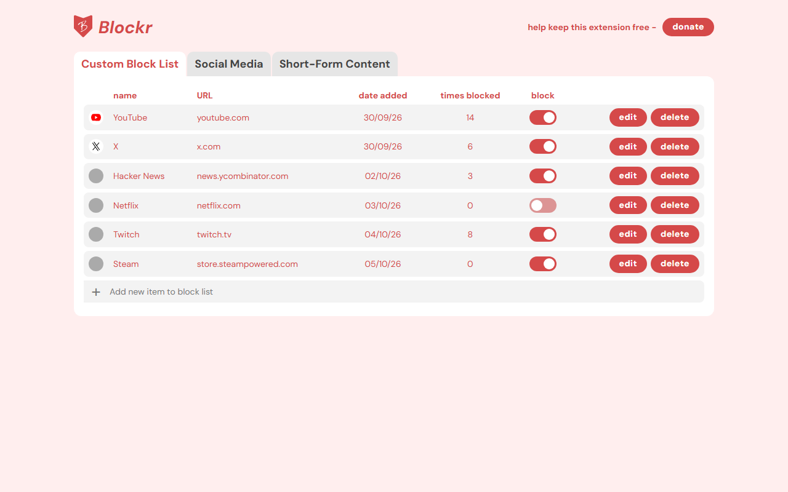

<div align="center">


# Blockr

**Block distracting websites and stay focused.**
A simple, private Chrome extension. No account, no tracking, no ads.

<!-- Replace with the real link once the extension is published. -->
Chrome Web Store: _coming soon_ · [Privacy policy](PRIVACY.md) · [Support the project](https://ko-fi.com/samaddev)

</div>

<p align="center">
  
  
</p>

## Features

- **Your own block list:** add any site, then edit, delete, or switch it on and off.
- **Ready-made lists:** social media (Instagram, TikTok, X, Facebook, Reddit) and short-form content (YouTube Shorts, TikTok, Instagram Reels). Every site has its own toggle.
- **One-click controls:** the popup has master switches for social media and short-form content.
- **Pause when you need to:** disable blocking, or pause for 15 minutes, 1 hour, or until tomorrow. It resumes automatically.
- **Daily time limits (optional):** give a custom site a limit such as 20 minutes a day. Time counts while you're watching the site (active tab, focused window, no input-free gap of 2.5 minutes) or any of its tabs is playing sound. Once used up, it's blocked until local midnight.
- **Block schedule (optional):** only block on chosen days and hours, such as work hours, including overnight windows.
- **Password protection (optional):** require a password to open the block list, or to pause or turn off blocking. Forgot it? A 6-hour cooling-off reset removes the password, and you can cancel it. It's a speed bump against impulsive changes, not a vault: Chrome still lets you disable or remove any extension.
- **Light and dark themes:** follow your system setting, or choose one. Colours are tuned for WCAG AA contrast.
- **Catches in-page navigation:** sites like YouTube that change page without reloading are still blocked.
- **A calm blocked page:** shows which site was blocked, with a button to go back.
- **See your progress:** each site shows how many times it has been blocked.

## Privacy

Everything stays in your browser. Blockr has no servers and sends nothing anywhere. See the full
[privacy policy](PRIVACY.md).

## Install from source

You need [Node.js](https://nodejs.org) 20 or newer.

```bash
cd react-app-source
npm install
npm run build
```

Then open `chrome://extensions`, turn on **Developer mode**, click **Load unpacked**, and select
`react-app-source/dist`.

## Development

```bash
cd react-app-source
npm run dev       # live-reloading dev build (load dist/ as above)
npm test          # unit tests
npm run lint
npm run package   # build + zip into release/blockr-<version>.zip for the Web Store
```

The code is React + TypeScript + Vite, bundled for Chrome with
[CRXJS](https://crxjs.dev). See [`react-app-source/README.md`](react-app-source/README.md) for the
project layout.

## How blocking works

The service worker turns your block list into `declarativeNetRequest` redirect rules, which send
top-level page loads to Blockr's blocked page. A `webNavigation` listener catches in-page
navigation, and tabs already open on a newly blocked site are moved to the blocked page.
Block counters and the pause state are kept in `chrome.storage.local`, and your list in
`chrome.storage.sync`.

## License

Blockr is free software, released under the [GNU General Public License v3.0](LICENSE).
You're welcome to read, learn from, and build on the code, but anything you distribute that
includes it must also be released under the GPL, with credit to the original.
Copyright (C) 2026 Samad Ali.

The Blockr name and logo are not covered by this license and may not be used for other projects.

## Feedback and support

This is my first Chrome extension, and feedback is welcome. Please
[open an issue](https://github.com/samad-a/blockr-chrome-extension/issues) or email
samadali.developer@gmail.com.

If Blockr helps you, you can [buy me a coffee on Ko-fi](https://ko-fi.com/samaddev).
